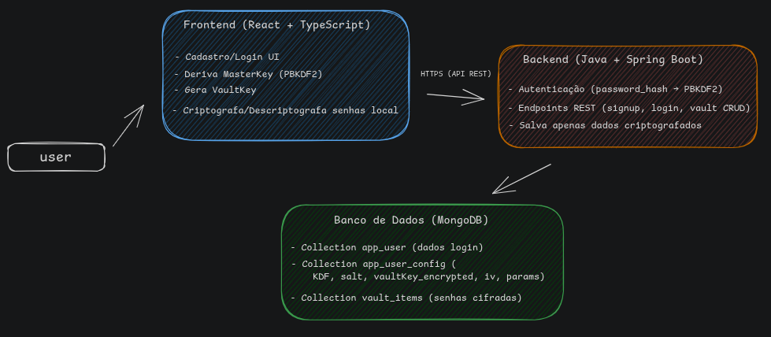
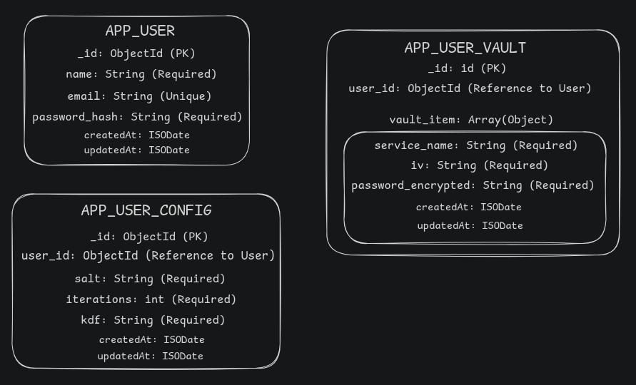

**himitsu-kagi-api** 
it's a project where i challenged myself to create an application that stores passwords from other platforms of a user, in a complete secure way.

this project is/was developed with Java and some important libraries such as Java Spring Boot, .....

**project overview**

**ER**

**summary flow**

1 - register
	- user creates account -> salves inside `app_user` (hashed password).
	- set up `salt` + `iterations` + `kdf` -> saves inside `app_user-config`.
	
2 - login
	- system validates password via `app_user.password_hash`
	- generates master key with `salt` + `password` -> store just in memory.
	
3 - save password from other platforms
	- master key + **AES with unique IV** -> encrypts service password.
	- save encrypted password + **IV** inside `app_user_vault`.
	
4 - search and show password
	- get register in `app_user_vault` (encrypted password + IV).
	- use master key + **AES decryption with stored IV** -> decrypts and displays to user.
